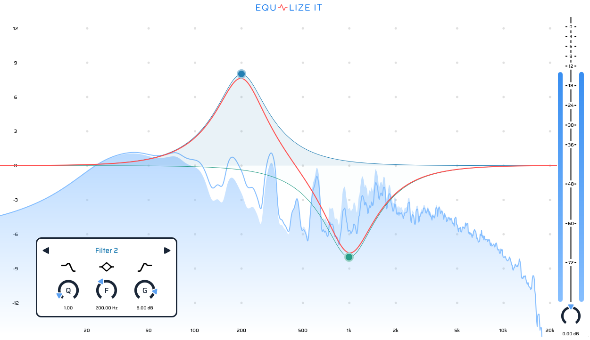

<a name="readme-top"></a>

<br />
<div align="center">
  

  <h3 align="center">Equalize It</h3>

  <p align="center">
    12-band parametric equalizer
  </p>
</div>

<h2>Table of Contents</h2>
<ol>
  <li>
    <a href="#about-the-project">About The Project</a>
    <ul>
      <li><a href="#built-with">Built With</a></li>
    </ul>
  </li>
  <li>
    <a href="#getting-started">Getting Started</a>
    <ul>
      <li><a href="#prerequisites">Prerequisites</a></li>
      <li><a href="#installation">Installation</a></li>
    </ul>
  </li>
  <li><a href="#usage">Usage</a></li>
  <li><a href="#license">License</a></li>
</ol>

## About The Project



The project is VST-plugin for equalization. The user interface includes a spectrum analyzer, a filter control panel, frequency response curves, and level meters.

There are 3 types of IIR-filters available:

- low pass;
- high pass;
- peak.

The releases have an installer for Windows, but if you want to test the plugin for other operating systems, try building it.

### Built With

- [JUCE](https://github.com/juce-framework/JUCE)
- [CMake](https://cmake.org/)
- [C++ spline library](https://github.com/ttk592/spline)
- [Friz](https://github.com/bgporter/animator)

## How to build

### Prerequisites

- [Install CMake](https://cmake.org/download/) version 3.21 or higher
- (Optional) [Install Clang](https://releases.llvm.org/download.html) compiler for C++
- (Optional) [Install Ninja](https://github.com/ninja-build/ninja/wiki/Pre-built-Ninja-packages) generator

### Installation

1. Clone the repo

   ```sh
   git clone https://github.com/SmEgDm/equalize_it.git
   ```

2. Install git-submodules

   ```sh
   git submodules update --init --recursive
   ```

3. Set the formats you need in `CMakeLists.txt` (all formats can be found [here](https://github.com/juce-framework/JUCE/blob/master/docs/CMake%20API.md))
   ```cmake
   set(FORMATS [<format> ...])
   ```

### Build

1. Configure the project

   ```sh
   cmake -B build G <generator>
   ```

2. Run build

   ```sh
   cmake --build build --config Debug
   ```

## Usage

### Add/Remove filters

The filter is _added_ by double-clicking on an empty area of ​​the spectrum analyzer. The filter can be _removed_ by pressing the right mouse button on the filter button (point on the spectrum analyzer).

### Filter panel

To _open_ the filter panel, click the filter button, and to _hide_ it, click on an empty area. The panel is _draggable_.

## License

Distributed under the GPL-3.0 License. See `LICENSE` for more information.
